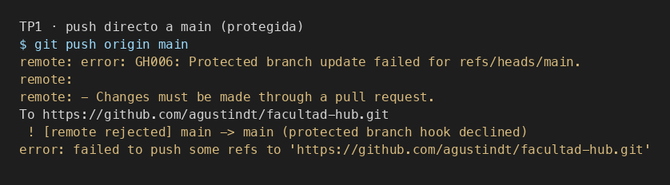
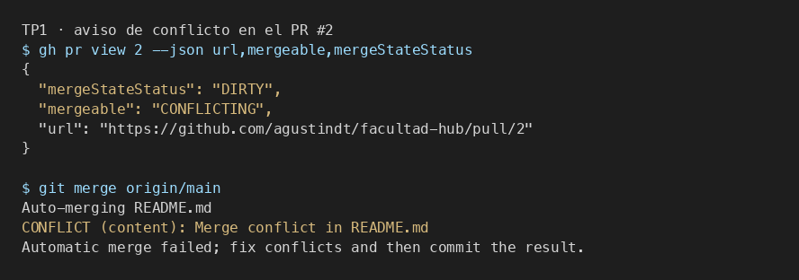
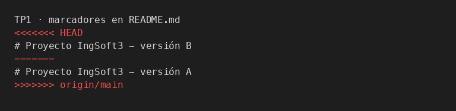

# Evidencias

> Una captura por ítem, con una línea de qué se está mirando.
> Las capturas son la prueba de que corrió en esta máquina.

---

## TP1 — Git colaborativo

### 1. Push directo a main rechazado



`git push origin main` después de activar la protección. GitHub responde
`GH006` / `protected branch hook declined`: los cambios tienen que entrar por
pull request, también para el dueño del repo (`enforce_admins`).

### 2. El PR de la rama B no se puede mergear: conflicto



El PR #1 (versión A) ya estaba en `main`. El PR #2 nació de `main` sin enterarse
de A y tocó la misma línea: `mergeable: CONFLICTING`, `mergeStateStatus: DIRTY`.
URL: https://github.com/agustindt/facultad-hub/pull/2

### 3. Marcadores del conflicto en el archivo



`git merge origin/main` sobre `feature/titulo-b`. `HEAD` es versión B; `origin/main`
es versión A. Git no elige: marca las dos y pide una decisión de contenido.

### 4. Release publicada

_(se agrega en el PR siguiente, en cuanto exista el tag `v1.0.0` y su release)_

---

## TP2 — Contenedores

- [ ] **`docker compose up -d` desde cero, todos los servicios sanos**
      `docker compose ps` mostrando los tres en `healthy`.

- [ ] **Funcionalidad end-to-end**
      El hub abierto en `localhost:8080`, mostrando notas del vault (frontend →
      backend → filesystem) y una tarjeta de repaso calificada (frontend →
      backend → Postgres).

- [ ] **Prueba de persistencia**
      Tres capturas encadenadas:
      1. Calificás tarjetas en Repaso.
      2. `docker compose down` y `up -d` → el calendario sigue ahí.
      3. `docker compose down -v` y `up -d` → el calendario arrancó de cero.
      La diferencia entre 2 y 3 es todo el punto del volumen nombrado.

- [ ] **Comparación de tamaño**
      `docker images` con la imagen final del backend al lado de `node:22`.

- [ ] **Imágenes públicas en el registry**
      La página de los paquetes en ghcr.io con visibilidad pública.

- [ ] **`docker-compose.registry.yml up` sin código local**
      Desde una carpeta limpia, con sólo el `.yml` y el `.env`: baja las imágenes
      y levanta. Si esto anda, las imágenes publicadas están bien.

### Comandos que usé

```bash
# levantar
cp .env.example .env
docker compose up -d
docker compose ps

# persistencia
docker compose down && docker compose up -d      # los datos siguen
docker compose down -v && docker compose up -d   # los datos se fueron

# tamaños
docker images | grep -E "facultad-hub|node"

# publicar
echo $GHCR_TOKEN | docker login ghcr.io -u agustindt --password-stdin
docker build -t ghcr.io/agustindt/facultad-hub-backend:v0.1.0 ./backend
docker build -t ghcr.io/agustindt/facultad-hub-frontend:v0.1.0 ./frontend
docker push ghcr.io/agustindt/facultad-hub-backend:v0.1.0
docker push ghcr.io/agustindt/facultad-hub-frontend:v0.1.0

# probar desde el registry, en una carpeta vacía
docker compose -f docker-compose.registry.yml up -d
```
