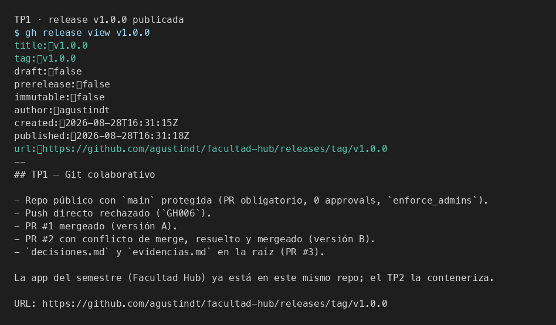
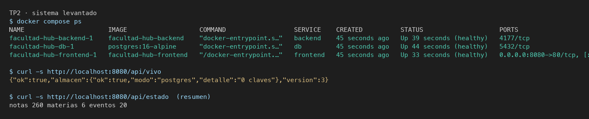
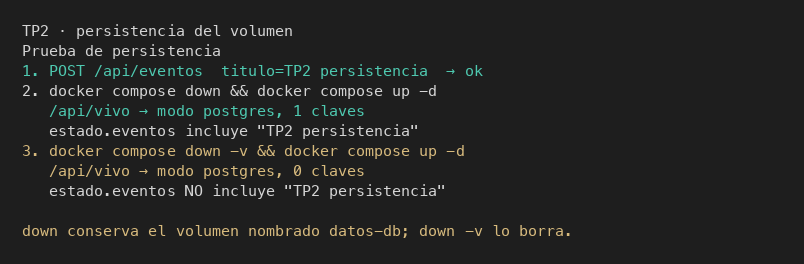
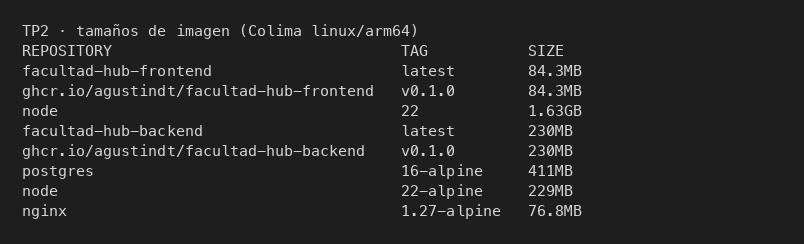

# Evidencias

> Una captura por ítem, con una línea de qué se está mirando.
> Las capturas son la prueba de que corrió en esta máquina.

---

## TP1 — Git colaborativo

### 1. Push directo a main rechazado

`git push origin main` después de activar la protección. GitHub responde
`GH006` / `protected branch hook declined`: los cambios tienen que entrar por
pull request, también para el dueño del repo (`enforce_admins`).

### 2. El PR de la rama B no se puede mergear: conflicto

El PR #1 (versión A) ya estaba en `main`. El PR #2 nació de `main` sin enterarse
de A y tocó la misma línea: `mergeable: CONFLICTING`, `mergeStateStatus: DIRTY`.
URL: https://github.com/agustindt/facultad-hub/pull/2

### 3. Marcadores del conflicto en el archivo

`git merge origin/main` sobre `feature/titulo-b`. `HEAD` es versión B; `origin/main`
es versión A. Git no elige: marca las dos y pide una decisión de contenido.

### 4. Release publicada

Release `v1.0.0` en https://github.com/agustindt/facultad-hub/releases/tag/v1.0.0

---

## TP2 — Contenedores

### Sistema levantado

`docker compose up -d --build`. Los tres servicios `healthy`. `/api/vivo` habla
con Postgres. `/api/estado` indexó 260 notas del vault.

### Persistencia

Creé el evento `TP2 persistencia`. `down` + `up`: `/api/vivo` sigue con 1 clave
y el evento está. `down -v` + `up`: 0 claves, el evento desapareció. El volumen
nombrado `datos-db` es la diferencia.

### Tamaños

`node:22` 1.63 GB vs imagen final del backend 230 MB. El frontend 84.3 MB sobre
`nginx:1.27-alpine` 76.8 MB.

### Registry

Las imágenes están en ghcr, tag `v0.1.0`:

- https://github.com/users/agustindt/packages/container/package/facultad-hub-backend
- https://github.com/users/agustindt/packages/container/package/facultad-hub-frontend

El push pidió alcance `write:packages` (un `docker login` con el token de `gh`
sin ese scope da `permission_denied`). Los packages nacen **privados**; la API
de GitHub no cambia visibilidad (PATCH 404). Hay que pasarlos a **públicos**
en Package settings → Change visibility, y después probar
`docker logout` + `docker pull` + `docker compose -f docker-compose.registry.yml
up -d` (la columna IMAGE tiene que decir `ghcr.io/...`, no `facultad-hub-backend`).

---

## TP3 — Planificación

No hay capturas: el Project es público.

- Project: https://github.com/users/agustindt/projects/5
- Épica #4 → historia #5 → tareas #6 y #7 (sub-issues)
- Bug #8 al costado
- Sprint 1 (7 días desde 2026-08-28) asignado a #5, #6 y #7
- PR del esqueleto de CI cierra la tarea #6
